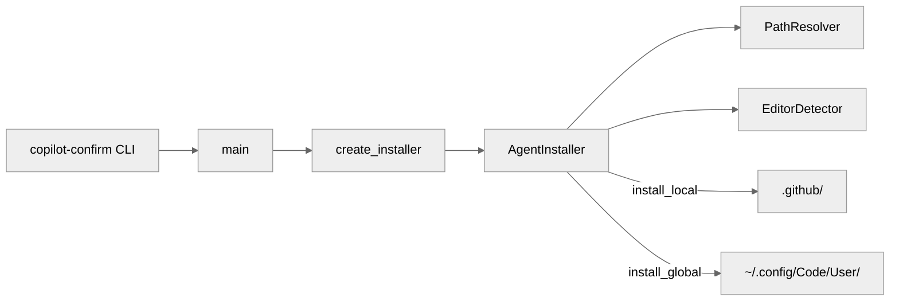
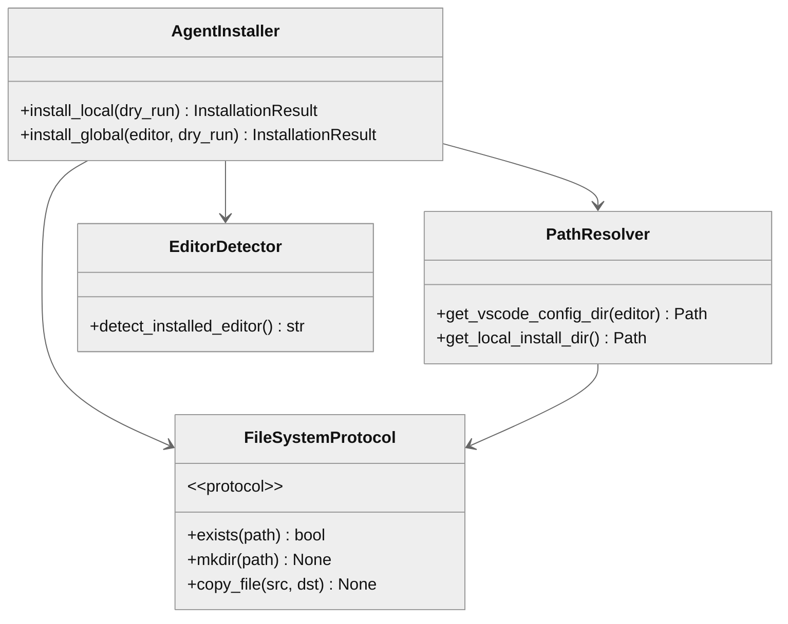

# copilot_confirm

AI-readable architectural contract for VS Code Copilot agent installation.

## 1. Component Overview

| Aspect | Value |
|--------|-------|
| **Name** | copilot_confirm |
| **Type** | package (CLI + library) |
| **Responsibility** | Install Copilot agents/instructions to local (.github/) or global (VS Code config) |
| **Language** | Python 3.13+ |
| **Runtime** | CPython |
| **Stack** | pathlib, shutil, argparse, logging |
| **State** | Stateless (no persistent state) |

**Entry Points**:
- CLI: `copilot-confirm` → `install.main()`
- Programmatic: `create_installer()` → `AgentInstaller`

**Key Decisions**:
- Protocol-based DI for testability (FileSystemProtocol, EnvironmentProtocol)
- Frozen dataclasses for immutable results
- Cross-platform path resolution via PathResolver

**Risks**: None significant (file copy operations only)

## 2. Code Layout

```
copilot_confirm/
├── __init__.py          # Public API exports
├── __version__.py       # Version metadata (0.1.0)
├── install.py           # Core installation logic (693 lines)
├── py.typed             # PEP 561 type marker
└── agent_files/         # Source files to install
    ├── agents/
    │   └── copilot_confirm.agent.md
    └── instructions/
        └── confirmation_workflow.instructions.md
```

## 3. Public Surface (⚠️ DO NOT MODIFY w/o approval)

### 🔒 Frozen Exports (`__init__.py`)

| Symbol | Type | Stability |
|--------|------|-----------|
| `AgentInstaller` | class | 🔒 frozen |
| `InstallationResult` | dataclass | 🔒 frozen |
| `create_installer()` | factory | 🔒 frozen |
| `__version__` | str | 🔒 frozen |

### Signatures

```python
# Factory (preferred entry point)
def create_installer(
    agent_files_dir: Path | None = None,
    logger: logging.Logger | None = None,
) -> AgentInstaller

# Result type
@dataclass(frozen=True)
class InstallationResult:
    success: bool
    files_copied: int
    target_dir: Path
    error_message: str | None = None

# Installer methods
class AgentInstaller:
    def install_local(self, dry_run: bool = False) -> InstallationResult
    def install_global(self, editor: str | None = None, dry_run: bool = False) -> InstallationResult
```

### ⚠️ Internal (may change)

| Symbol | Purpose |
|--------|---------|
| `PathResolver` | Cross-platform path construction |
| `EditorDetector` | VS Code variant detection |
| `FileSystemProtocol` | DI abstraction for testing |
| `EnvironmentProtocol` | DI abstraction for testing |
| `setup_logging()` | Logger configuration |

**Change Impact**: Modifying frozen APIs breaks downstream consumers.

## 4. Dependencies

### depends_on[]
- Python stdlib: pathlib, shutil, argparse, logging, platform, os, sys
- No third-party runtime deps

### required_by[]
- CLI users via `copilot-confirm` command
- Programmatic users via `create_installer()`

### IO
- **fs**: Read agent_files/, write to .github/ or VS Code config
- **CLI**: stdout/stderr for user feedback

## 5. Invariants & Errors (⚠️ MUST PRESERVE)

### Invariants
- `agent_files/` must exist with valid source files
- Target directories created with `parents=True, exist_ok=True`
- Dry-run mode NEVER writes files

### Verification
```bash
pdm run test          # 36 tests, 100% coverage
pdm run lint          # ruff check
pdm run typecheck     # mypy --strict
```

### Errors

| Exception | When Raised |
|-----------|-------------|
| `ValueError` | Unsupported OS in PathResolver |
| `SystemExit(1)` | CLI failure (--global + --local, missing config) |

### Side Effects
- **Disk writes**: Copies files to target directories
- **Directory creation**: Creates .github/, prompts/ as needed
- **No network**: Offline operation only

## 6. Usage

### CLI
```bash
# Local install (default)
copilot-confirm --dry-run
copilot-confirm

# Global install
copilot-confirm --global --insiders
copilot-confirm --global --dry-run

# Debug
copilot-confirm --log-level DEBUG --log-file install.log
```

### Programmatic
```python
from copilot_confirm import create_installer

installer = create_installer()
result = installer.install_local(dry_run=True)
if result.success:
    print(f"Would install {result.files_copied} files")
```

### Config
- No config files required
- Uses platform-standard paths (XDG on Linux, APPDATA on Windows)

### Testing
```bash
pdm run test              # Run tests
pdm run test-cov          # With coverage
```

### Pitfalls
| Issue | Fix |
|-------|-----|
| "Agent files directory not found" | Run from package install, not source |
| "Could not find Code configuration" | Use --insiders or install VS Code |
| Both --global and --local | Pick one |

## 7. AI-Accessibility Map (⚠️ CRITICAL)

| Task | Target | Guards | Change Impact |
|------|--------|--------|---------------|
| Add new editor variant | `PathResolver.EDITOR_PATHS` | Add all 3 OS entries | None (additive) |
| Add new file to install | `AgentInstaller.LOCAL_FILES/GLOBAL_FILES` | Add FileMapping | None (additive) |
| Change install paths | `PathResolver.get_*` methods | Update tests | Breaks existing installs |
| Add CLI flag | `main()` argparse section | Update tests + docs | None (additive) |
| Modify result fields | `InstallationResult` | ⚠️ FROZEN | Breaks all consumers |
| Add logging | Any method | Use self.logger | None |

### Prohibited Patterns
- Direct file I/O without FileSystemProtocol (breaks tests)
- Modifying frozen dataclass fields
- Adding required constructor args to public classes

## 8. Mermaid

### Component Flow


### Class Relationships

